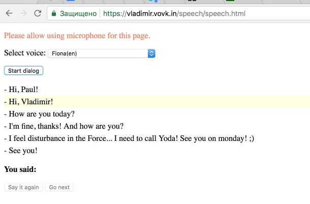

# Dialog

I recently discovered a new specification for the [Web Speech API](https://developer.mozilla.org/en-US/docs/Web/API/Web_Speech_API) on the MDN site.

> The Web Speech API enables you to incorporate voice data into web apps. The Web Speech API has two parts: SpeechSynthesis (Text-to-Speech), and SpeechRecognition (Asynchronous Speech Recognition.)

This is an experimental technology. But for now we can try some features in Chrome. 

I decided to try to create a small dialogue simulator. [Check it out](https://vladimir.vovk.in/speech/speech.html)!

P.S. You need to open this link in Chrome browser and allow using microphone for this page.

